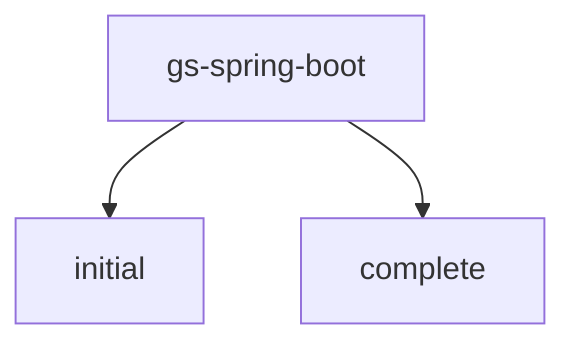

# 基础信息

|      |      |
|------|------|
| 名称 | gs-spring-boot |
| 编码语言 | .java |
| 代码路径 | gs-spring-boot |
| 概述说明 | Spring Boot Web应用模块，包含启动类和控制器，用于Bean监控、调试、性能优化、配置验证及根路径请求处理。 |

# 说明

## 概述

该代码模块是一个基于Spring Boot的Web应用程序，主要包含两个核心部分：应用启动类和HTTP请求处理控制器。应用启动类负责启动Spring Boot应用程序，并在启动时打印所有由Spring管理的Bean名称，用于调试和监控。HTTP请求处理控制器则负责处理根路径的请求，并返回一个简单的问候信息。该模块适用于快速搭建基础的Web服务，并提供了扩展功能的基础框架。

## 主要业务场景

1. **应用启动监控**：在应用启动时，通过打印所有Spring管理的Bean名称，开发者可以快速了解应用启动过程中加载了哪些组件，有助于发现潜在的依赖问题或配置错误。
2. **调试与排查**：在开发和测试阶段，该功能可以帮助开发者快速定位Bean加载问题，特别是在复杂的依赖注入场景中，能够更清晰地看到Spring容器中的Bean结构。
3. **性能优化**：通过查看加载的Bean列表，开发者可以识别出不必要的Bean加载，从而优化应用的启动性能和资源占用。
4. **配置验证**：在应用配置发生变化后，该功能可以用于验证新的配置是否按预期加载了正确的Bean，确保配置的正确性和一致性。
5. **根路径请求处理**：当用户访问应用程序的根路径（如`/`）时，控制器会响应并返回一个问候信息。这通常用于验证应用程序是否正常运行，或者作为一个简单的欢迎页面。
6. **快速验证**：该模块可以用于快速验证Spring Boot应用程序的基本功能，确保控制器能够正确响应HTTP请求。
7. **依赖注入**：通过Spring的依赖注入机制，自动装配Bean，简化代码结构并提高可维护性。
8. **快速Web服务搭建**：该模块提供了一个基础的Web服务框架，开发者可以在此基础上扩展更多功能，如添加更多的控制器、服务层、数据访问层等，以满足更复杂的业务需求。

### 包内部结构视图

该流程图展示了`gs-spring-boot`项目的层级结构，包含两个子目录：`initial`和`complete`。`initial`和`complete`均为`gs-spring-boot`的直接子目录，表示项目的初始状态和完成状态。这种结构常用于开发或学习项目，便于区分不同阶段的代码或资源。

# 文件列表 File List

| 名称   | 类型  | 说明 |
|-------|------|-------------|
| [complete](complete/src/main/java/com/_module.md) | folder | Spring Boot应用启动类，包含主方法和Bean检查功能，确保应用正常启动和配置。 |
| [initial](initial/src/main/java/com/_module.md) | folder | Spring Boot启动类打印Bean名称用于调试监控，Web应用处理根路径请求返回问候信息。 |

