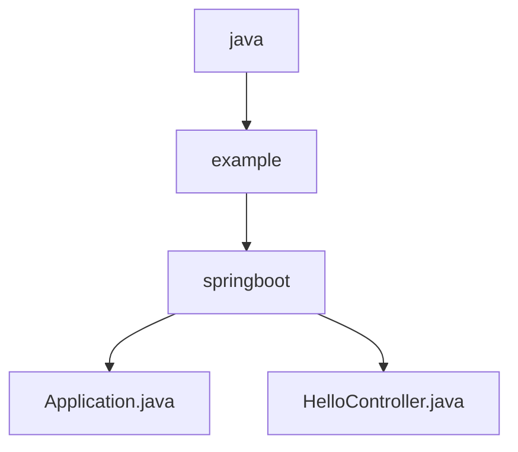

# 基础信息

|      |      |
|------|------|
| 名称 | com |
| 编码语言 | .java |
| 代码路径 | gs-spring-boot/complete/src/main/java/com |
| 包名 | gs-spring-boot.complete.src.main.java.com |
| 概述说明 | Spring Boot应用启动类，包含主方法和Bean检查功能，确保应用正常启动和配置。 |

# 说明

## 概述

该代码模块是一个基于Spring Boot的Web应用程序，主要包含两个核心部分：应用启动类和控制器类。应用启动类负责启动Spring Boot应用程序，并确保所有必要的Bean已正确加载和配置。控制器类则处理HTTP请求，返回简单的欢迎信息。该模块适用于快速搭建基础的Web服务，并提供了扩展功能的基础框架。

## 主要业务场景

1. **应用启动**：通过`main`方法启动Spring Boot应用程序，加载所有配置的Bean和组件，确保应用能够正常运行。
2. **Bean检查**：在应用启动过程中，检查所有Bean是否已正确加载和配置，确保应用在启动后能够正常运行。
3. **配置管理**：加载和管理应用的配置文件，确保应用在启动时能够读取到正确的配置信息。
4. **依赖注入**：通过Spring的依赖注入机制，自动装配Bean，简化代码结构并提高可维护性。
5. **欢迎信息展示**：通过Spring Boot控制器类处理HTTP GET请求，返回一个简单的欢迎信息。该场景适用于用户访问应用程序的根路径时，展示一个友好的欢迎页面或消息。
6. **快速Web服务搭建**：该模块提供了一个基础的Web服务框架，开发者可以在此基础上扩展更多功能，如添加更多的控制器、服务层、数据访问层等，以满足更复杂的业务需求。

### 包内部结构视图

该流程图展示了从`java`到`example`再到`springboot`的层级关系，并在`springboot`节点下包含了两个文件：`Application.java`和`HelloController.java`。每个节点仅显示路径的最后一级元素，清晰地反映了路径的层级结构。

# 文件列表 File List

| 名称   | 类型  | 说明 |
|-------|------|-------------|
| [example](example/_module.md) | package | Spring Boot应用启动类，包含主方法和Bean检查功能，确保应用正常启动和配置。 |

