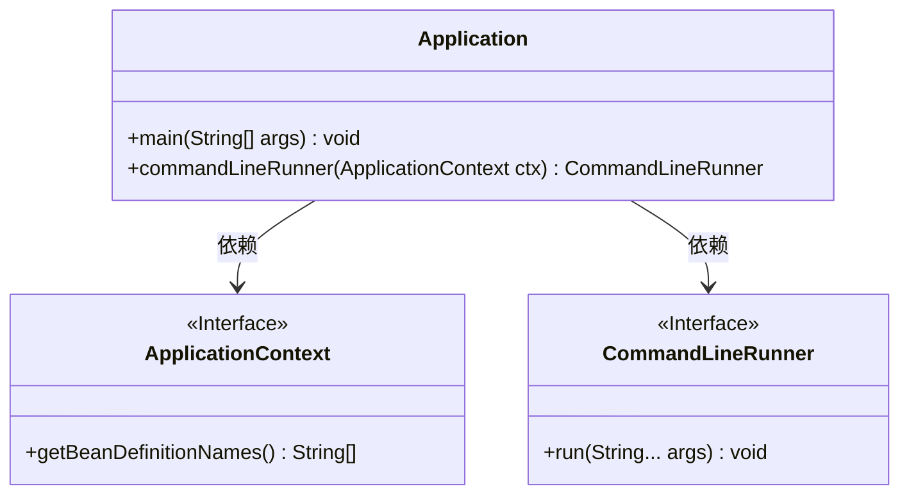
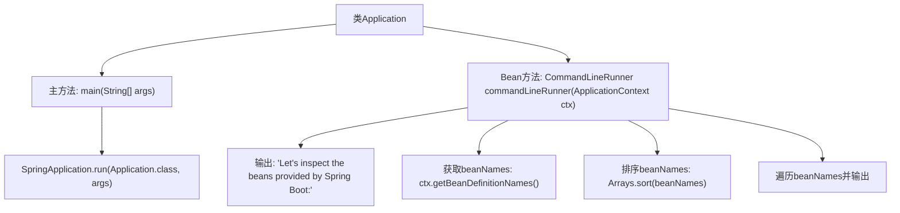

# 基础信息

|      |      |
|------|------|
| 名称 | Application |
| 编码语言 | .java |
| 代码路径 | gs-spring-boot/complete/src/main/java/com/example/springboot/Application.java |
| 包名 | com.example.springboot |
| 依赖项 | ['java.util.Arrays', 'org.springframework.boot.CommandLineRunner', 'org.springframework.boot.SpringApplication', 'org.springframework.boot.autoconfigure.SpringBootApplication', 'org.springframework.context.ApplicationContext', 'org.springframework.context.annotation.Bean'] |
| 概述说明 | Spring Boot启动类，含主方法及Bean检查功能。 |

# 说明

## 概述

该代码模块是一个基于Spring Boot的应用启动类，主要用于启动Spring Boot应用程序。它包含主方法（`main`方法），是应用程序的入口点。此外，该类还具备Bean检查功能，用于确保在应用启动时所有必要的Bean都已正确加载和配置。

## 主要业务场景

1. **应用启动**：通过`main`方法启动Spring Boot应用程序，加载所有配置的Bean和组件。
2. **Bean检查**：在应用启动过程中，检查所有Bean是否已正确加载和配置，确保应用在启动后能够正常运行。
3. **配置管理**：加载和管理应用的配置文件，确保应用在启动时能够读取到正确的配置信息。
4. **依赖注入**：通过Spring的依赖注入机制，自动装配Bean，简化代码结构并提高可维护性。

# 类列表 Class Summary

| 名称   | 类型  | 说明 |
|-------|------|-------------|
| Application | class | Spring Boot应用启动类，包含主方法和Bean检查功能。 |

## 类 Application

|      |      |
|------|------|
| 访问范围 | @SpringBootApplication;public |
| 类型 | class |
| 名称 | Application |
| 说明 | Spring Boot应用启动类，包含主方法和Bean检查功能。 |

### UML类图

这段代码定义了一个Spring Boot应用程序的入口类`Application`，其中包含`main`方法用于启动应用，并通过`commandLineRunner`方法返回一个`CommandLineRunner`实例，用于在应用启动后执行自定义逻辑。`CommandLineRunner`接口的实现会检查并打印Spring容器中所有的Bean名称。`ApplicationContext`接口提供了获取Bean定义名称的方法。

### 内部方法调用关系图

这段代码是一个Spring Boot应用程序的入口类，主方法启动Spring应用，并通过`CommandLineRunner` bean在应用启动时执行一段代码。该代码会输出Spring Boot提供的所有bean名称，首先获取所有bean的名称并排序，然后逐个输出。

### 字段列表 Field List

| 名称  | 类型  | 说明 |
|-------|-------|------|

### 方法列表 Method List

| 名称  | 类型  | 说明 |
|-------|-------|------|
| main | void | Java启动Spring应用的入口方法。 |
| commandLineRunner | CommandLineRunner | Spring Boot命令运行器打印所有Bean名称。 |

