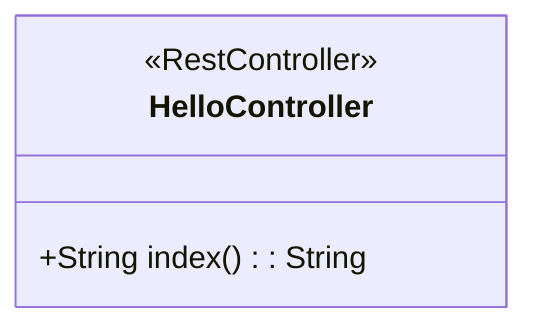
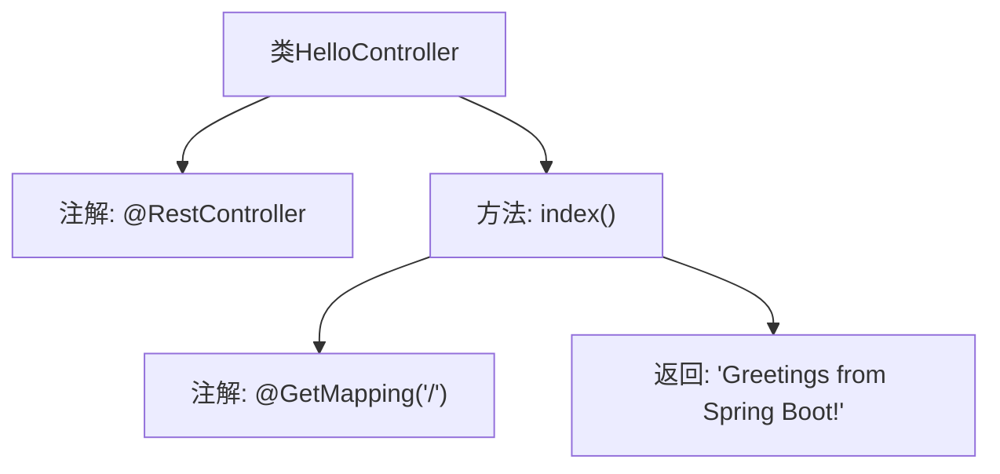

# 基础信息

|      |      |
|------|------|
| 名称 | HelloController |
| 编码语言 | .java |
| 代码路径 | gs-spring-boot/complete/src/main/java/com/example/springboot/HelloController.java |
| 包名 | com.example.springboot |
| 依赖项 | ['org.springframework.web.bind.annotation.GetMapping', 'org.springframework.web.bind.annotation.RestController'] |
| 概述说明 | Spring Boot控制器类用于返回欢迎信息。 |

# 说明

## 概述
该代码模块是一个基于Spring Boot的Web应用程序，主要功能是通过控制器类返回欢迎信息。模块的核心业务场景是处理HTTP请求并返回简单的欢迎消息，适用于需要快速搭建一个基础的Web服务场景。

## 主要业务场景
1. **欢迎信息展示**：通过Spring Boot控制器类处理HTTP GET请求，返回一个简单的欢迎信息。该场景适用于用户访问应用程序的根路径时，展示一个友好的欢迎页面或消息。
2. **快速Web服务搭建**：该模块提供了一个基础的Web服务框架，开发者可以在此基础上扩展更多功能，如添加更多的控制器、服务层、数据访问层等，以满足更复杂的业务需求。

# 类列表 Class Summary

| 名称   | 类型  | 说明 |
|-------|------|-------------|
| HelloController | class | Spring Boot控制器类，返回欢迎信息。 |

## 类 HelloController

|      |      |
|------|------|
| 访问范围 | @RestController;public |
| 类型 | class |
| 名称 | HelloController |
| 说明 | Spring Boot控制器类，返回欢迎信息。 |

### UML类图

这段代码定义了一个名为 `HelloController` 的类，该类被标记为 `@RestController`，表示它是一个Spring Boot中的控制器类。该类包含一个公有方法 `index()`，该方法通过 `@GetMapping("/")` 注解映射到根路径，并返回一个字符串 "Greetings from Spring Boot!"。这个类的主要作用是处理HTTP GET请求，并返回一个简单的问候消息。

### 内部方法调用关系图

这段代码定义了一个名为 `HelloController` 的类，使用了 `@RestController` 注解，表示这是一个处理HTTP请求的控制器。类中包含一个 `index()` 方法，使用了 `@GetMapping("/")` 注解，表示当访问根路径时，会调用该方法并返回字符串 "Greetings from Spring Boot!"。这段代码主要用于创建一个简单的Spring Boot应用，处理根路径的GET请求并返回问候信息。

### 字段列表 Field List

| 名称  | 类型  | 说明 |
|-------|-------|------|

### 方法列表 Method List

| 名称  | 类型  | 说明 |
|-------|-------|------|
| index | String | Spring Boot控制器映射根路径返回问候语。 |

