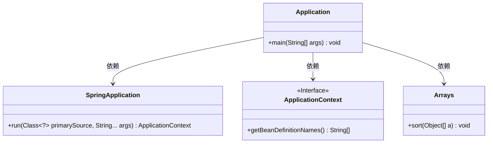
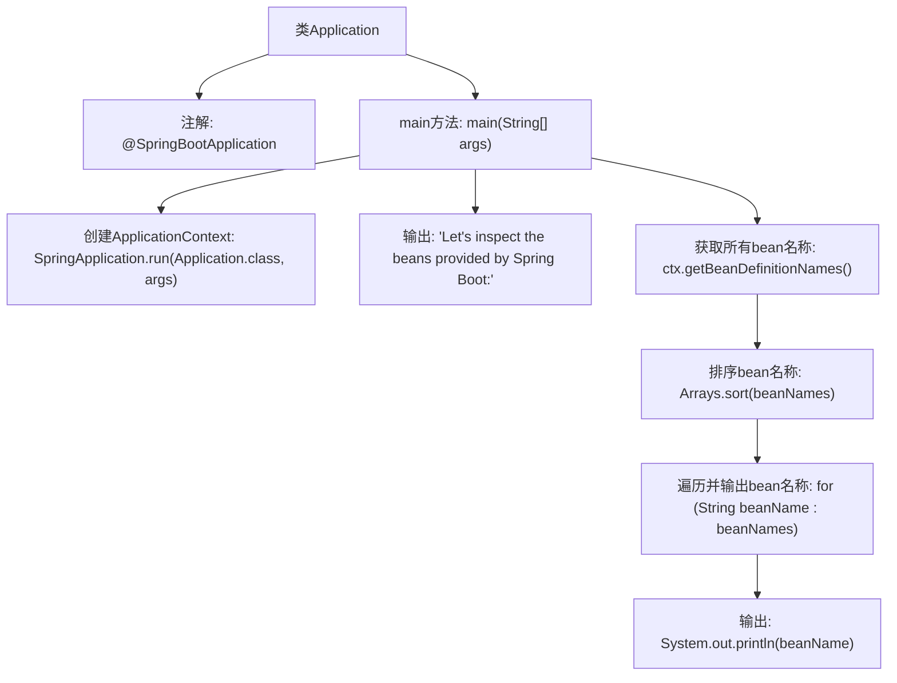

# 基础信息

|      |      |
|------|------|
| 名称 | Application |
| 编码语言 | .java |
| 代码路径 | gs-spring-boot/initial/src/main/java/com/example/springboot/Application.java |
| 包名 | com.example.springboot |
| 依赖项 | ['java.util.Arrays', 'org.springframework.boot.SpringApplication', 'org.springframework.boot.autoconfigure.SpringBootApplication', 'org.springframework.context.ApplicationContext'] |
| 概述说明 | Spring Boot启动类打印所有Spring管理的Bean名称。 |

# 说明

## 概述

该代码模块是一个基于Spring Boot的应用启动类，其主要功能是在应用启动时打印所有由Spring管理的Bean名称。这个功能通常用于调试和监控，帮助开发者了解应用启动时Spring容器中加载了哪些Bean，从而更好地理解应用的依赖关系和初始化过程。

## 主要业务场景

1. **应用启动监控**：在应用启动时，通过打印所有Spring管理的Bean名称，开发者可以快速了解应用启动过程中加载了哪些组件，有助于发现潜在的依赖问题或配置错误。
2. **调试与排查**：在开发和测试阶段，该功能可以帮助开发者快速定位Bean加载问题，特别是在复杂的依赖注入场景中，能够更清晰地看到Spring容器中的Bean结构。
3. **性能优化**：通过查看加载的Bean列表，开发者可以识别出不必要的Bean加载，从而优化应用的启动性能和资源占用。
4. **配置验证**：在应用配置发生变化后，该功能可以用于验证新的配置是否按预期加载了正确的Bean，确保配置的正确性和一致性。

# 类列表 Class Summary

| 名称   | 类型  | 说明 |
|-------|------|-------------|
| Application | class | Spring Boot应用启动类，打印所有Spring管理的Bean名称。 |

## 类 Application

|      |      |
|------|------|
| 访问范围 | @SpringBootApplication;public |
| 类型 | class |
| 名称 | Application |
| 说明 | Spring Boot应用启动类，打印所有Spring管理的Bean名称。 |

### UML类图

这段代码是一个Spring Boot应用程序的入口类，标记为`@SpringBootApplication`，表示这是一个Spring Boot应用。`main`方法启动Spring应用上下文，并获取所有由Spring Boot提供的Bean名称，排序后打印出来。类图中展示了`Application`类与`SpringApplication`、`ApplicationContext`和`Arrays`类之间的依赖关系，分别用于启动应用、获取Bean定义和排序数组。

### 内部方法调用关系图

这段代码是一个Spring Boot应用程序的入口类，使用`@SpringBootApplication`注解标记。`main`方法启动Spring Boot应用，并获取应用上下文中的所有bean定义名称，排序后逐一输出。流程从启动应用开始，依次获取bean名称、排序、遍历并输出，展示了Spring Boot自动配置的bean列表。

### 字段列表 Field List

| 名称  | 类型  | 说明 |
|-------|-------|------|

### 方法列表 Method List

| 名称  | 类型  | 说明 |
|-------|-------|------|
| main | void | Spring Boot启动应用，输出所有注册的Bean名称。 |

