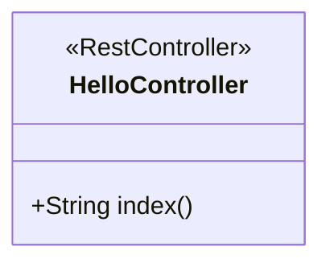
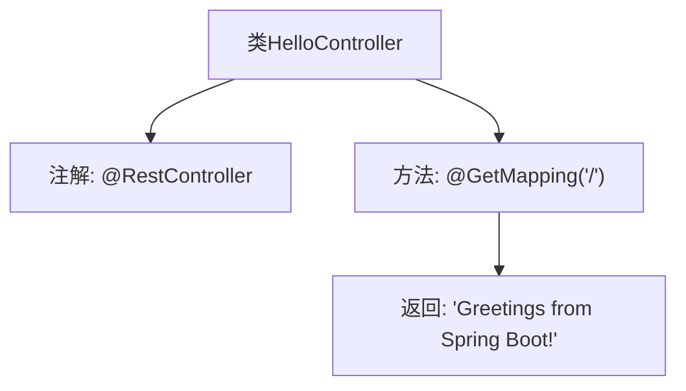

# 基础信息

|      |      |
|------|------|
| 名称 | HelloController |
| 编码语言 | .java |
| 代码路径 | gs-spring-boot/initial/src/main/java/com/example/springboot/HelloController.java |
| 包名 | com.example.springboot |
| 依赖项 | ['org.springframework.web.bind.annotation.GetMapping', 'org.springframework.web.bind.annotation.RestController'] |
| 概述说明 | Spring Boot控制器在根路径返回问候信息。 |

# 说明

## 概述
该代码模块是一个基于Spring Boot的简单Web应用程序，主要用于处理HTTP请求并返回相应的问候信息。模块的核心功能是通过控制器（Controller）处理根路径的请求，并返回一个简单的问候消息。

## 主要业务场景
- **根路径请求处理**：当用户访问应用程序的根路径（如`/`）时，控制器会响应并返回一个问候信息。这通常用于验证应用程序是否正常运行，或者作为一个简单的欢迎页面。
- **快速验证**：该模块可以用于快速验证Spring Boot应用程序的基本功能，确保控制器能够正确响应HTTP请求。

# 类列表 Class Summary

| 名称   | 类型  | 说明 |
|-------|------|-------------|
| HelloController | class | Spring Boot控制器，根路径返回问候信息。 |

## 类 HelloController

|      |      |
|------|------|
| 访问范围 | @RestController;public |
| 类型 | class |
| 名称 | HelloController |
| 说明 | Spring Boot控制器，根路径返回问候信息。 |

### UML类图

这段代码定义了一个名为 `HelloController` 的类，该类使用了 `@RestController` 注解，表明它是一个Spring Boot中的控制器类。`HelloController` 类中包含一个公有方法 `index()`，该方法使用了 `@GetMapping("/")` 注解，表示当访问根路径时，将返回字符串 "Greetings from Spring Boot!"。这个类的主要作用是处理HTTP GET请求，并返回一个简单的问候消息。

### 内部方法调用关系图

这段代码定义了一个名为 `HelloController` 的类，该类被 `@RestController` 注解标记，表示它是一个 RESTful 控制器。类中包含一个 `@GetMapping("/")` 注解的方法 `index()`，该方法处理根路径的 GET 请求，并返回字符串 "Greetings from Spring Boot!"。流程图展示了类的结构和方法之间的调用关系。

### 字段列表 Field List

| 名称  | 类型  | 说明 |
|-------|-------|------|

### 方法列表 Method List

| 名称  | 类型  | 说明 |
|-------|-------|------|
| index | String | Spring Boot控制器返回问候信息。 |

